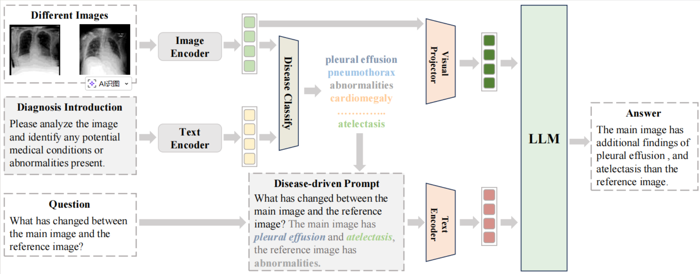
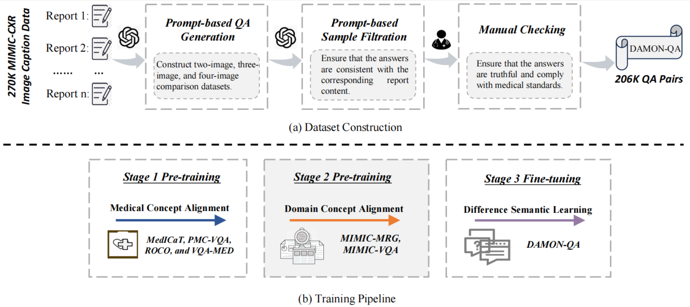

# Source Code of DAMON 
The official codes for "DAMON: Difference-Aware Medical Visual Question Answering via Multimodal Large Language Model" (Authors: Zefan Zhang, Yanhui Li, Ruihong Zhao, Bai Tian).

## Model Architecture
 

The framework of DAMON. The DAMON model uses a visual feature encoder to encode multiple input medical images and simultaneously sends them to a disease classification model for a preliminary diagnosis of the primary disease. The preliminary disease information is then combined with the question to form a complete prompt, which, along with the images, is sent to the LLM for reasoning to obtain the final multi-image diagnosis results.
## Training Pipeline and Dataset Construction
 

(a) Construction process of the DAMON-QA dataset. The Prompt-based QA Generation and Self-consistency are based on ChatGPT. (b)Training Pipeline contains Medical Concept Alignment, Domain Concept Alignment, and Difference Semantic Learning.

The prompts for dataset construction and self-consistency validation can be found in this file  ``./model/Prompt.txt``. 
## Required Environment
To run the codes, you need to install the requirements for [RE](requirements.txt).

    pip install -r requirements.txt

## Data Preparation

* **ROCO**: The dataset is available for download [ROCOv2](https://zenodo.org/records/8333645). Contains 79,789 radiological images along with associated medical concepts and captions extracted from the PMC Open Access subset.
* **PMC-VQA**: The dataset is available for download [PMC-VQA](https://github.com/xiaoman-zhang/PMC-VQA).  Contains 227k VQA pairs from 149k images, covering various imaging modalities (MRI, CT, X-ray, etc.) and diseases.
* **MedICaT**: The dataset is available for download [MedICaT](https://github.com/allenai/medicat). Consists of 217k images from 131k open-access biomedical papers, including captions, inline references, and manually annotated subfigures and subcaptions for a subset of PubMed Central figures.
* **VQA-Med**: The dataset is available for download [VQA-Med](https://zenodo.org/records/10499039). Contains 4,200 radiology images and 15,292 question–answer pairs focusing on four clinical question categories: Modality, Plane, Organ System, and Abnormality.
* **MIMIC-CXR**: The dataset is available for download [MIMIC-CXR](https://www.physionet.org/content/mimic-cxr-jpg/2.0.0/). A large-scale chest X-ray dataset comprising 377,110 images and 227,827 reports from 63,478 patients.
* **MIMIC-Diff-VQA**: The dataset is available for download [MIMIC-Diff-VQA](https://github.com/Holipori/MIMIC-Diff-VQA). A VQA dataset containing 700,703 QA pairs over 164,324 sets of longitudinal chest X-ray images. The images are a subset of MIMIC-CXR and the questions are categorized into difference, presence, abnormality, view, location, level, and type, where the “difference” QA pairs constitute the MIMIC-Diff-VQA dataset.
* **SLAKE**: The dataset is available for download [SLAKE](https://huggingface.co/datasets/BoKelvin/SLAKE). A large-scale, semantically annotated, and knowledge-enhanced bilingual dataset designed for training and evaluating medical VQA systems.
* **VQA-RAD**: The dataset is available for download [VQA-RAD](https://huggingface.co/datasets/flaviagiammarino/vqa-rad). The first manually constructed Med-VQA dataset in which clinicians asked naturally occurring questions about radiology images and provided reference answers.

* Then you should put all images in the ``dataset``.

The structured textual annotations of our **DAMON-QA** dataset, along with those of the aforementioned datasets, can be found at this link [link](https://pan.baidu.com/s/13Cer1XgmFCuuCc2NQZS_cg?pwd=9qw3).


## Training

Before starting the training process, please make sure that all the datasets mentioned above have been downloaded and prepared properly.

### 1. Download the Pre-trained Model

Before the second-stage fine-tuning, download the pre-trained model **InternVL2-2B** and place it under the directory `./model/pretrained/`:

```bash
huggingface-cli download --resume-download --local-dir-use-symlinks False \OpenGVLab/InternVL2-2B --local-dir InternVL2-2B
```

### 2. Prepare Customized Data

After downloading the pre-trained model, prepare your customized SFT data.

The JSON configuration file should follow the format below:

```json
{
  "your-custom-dataset-1": {
    "root": "path/to/the/image/",
    "annotation": "path/to/the/jsonl/annotation",
    "data_augment": false,
    "max_dynamic_patch": 12,
    "repeat_time": 1,
    "length": "number of samples in the dataset"
  }
}
```
Our JSON configuration files are provided in the following directory:``./model/shell/data``

### 3.Finetuning
Use the following command to fine-tune the model:
```bash
GPUS=8 PER_DEVICE_BATCH_SIZE=1 sh shell/internvl2.0/2nd_finetune/internvl2_2b_internlm2_1_8b_dynamic_res_2nd_finetune_full.sh
```
More detailed parameter configurations can be found in: ``./model/shell/internvl2.0/2nd_finetune``

Stage 1: Fine-tune using the data in the stage-1 folder.

Stage 2: Fine-tune using the data in the stage-2 folder.

Stage 3: Fine-tune using the data in the DAMON-QA folder.

DPM: Fine-tune using the data in the DPM folder.

Single-Image Testing: Test using the data in single-image.

## Evaluation
You can evaluate the model using the following command:
```bash
GPUS=1 sh evaluate.sh pretrained/InternVL2-2B [optional] --dynamic
```

For more details on fine-tuning InternVL, please refer to the official documentation [here](https://internvl.readthedocs.io/en/latest/internvl2.0/quick_start.html).

## Acknowledge
Sincerely thanks to [***Internvl***](https://github.com/OpenGVLab/InternVL) and [***EKAID***](https://github.com/Holipori/EKAID) for their contributions to this study.


```
